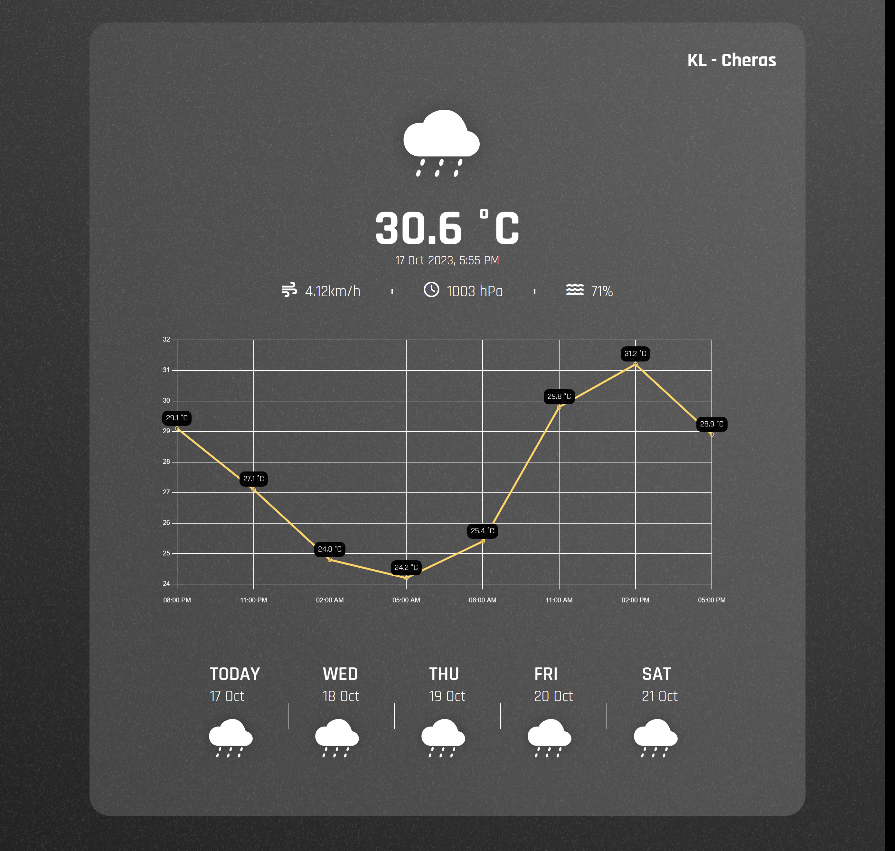

# Vanilla JS Weather website
This is Simple Weather website that used OpenWeatherMap API to load data from my hometown(other location support coming soon) with graph.js

## Table of content
* [Installation](#installation)
### Installation
1. Clone this project
2. Run ```npm install```
3. Create API.js on root folder
4. Copy code below to API.js 
```
const key = {KEY: "Insert your OpenWeatherMap Auth Key Here"} 
    // Free Plan API Key will work just fine
```
3. Run ```npm run dev```
4. Open the Local Host Link

